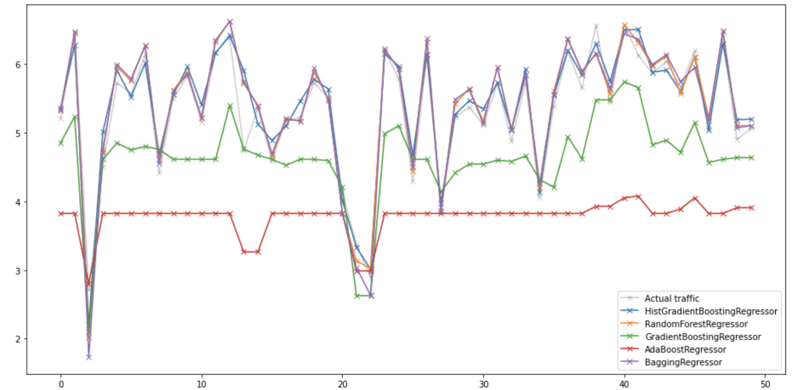
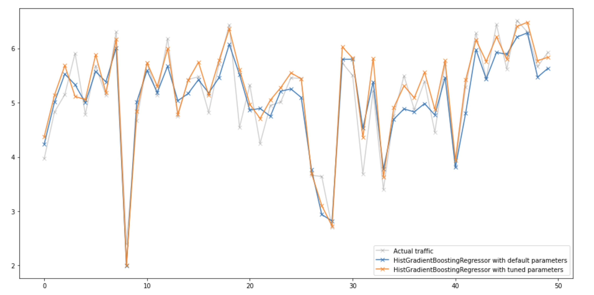

### Date : 11/2021  
### Polytechnique-HEC Master in Data Science
# Description of the project
This project aims at predicting the bicycle traffic in some specific locations in Paris.  
30 counting stations were installed in strategic bicycling lines of the capital. to count the number of bikes passing by over one hour. It was decided to take the logarithm of the bike counts for repartition concerns.  
This information could be very useful for the administration of the city in order to provide adapted facilities to the inhabitant.  
  
All the data is accessible on the following Github page :  
https://github.com/rth/bike_counters   
  
For this project, we could add all the external data that could impact the use of bikes in Paris.  
We added 4 external sources to our dataset :  
- Orly weather (Meteo France)  
- Paris weather	 (https://www.visualcrossing.com/weather/weather-data-services#/login)  
- Holidays calendar	(https://www.data.gouv.fr/en/)  
- Covid calendar
  
# Results  
After exploring the data, adding external data, we processed some feature engineering and compared different models :  

  
HistGradientBoosting appeared to be the best model, we optimized it and got us the following results :   
- RMSE = 0.7  
- ranking = 2/15 on a hidden test dataset  
  
Here are the forecasting results of the HistGradientBoosting model :  
